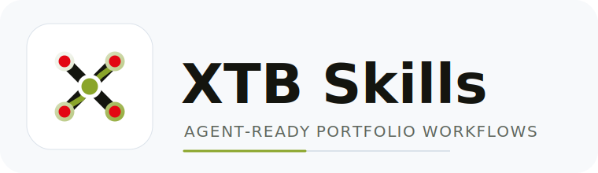

# XTB Portfolio Review & CSV Exporters

[](https://skills.sh/farcasclaudiu/xtb-investment-tools)

<p>
  
</p>

A set of Python tools that turn an **XTB brokerage report** (`.xlsx` export) into:

1. A complete, human-readable **portfolio review** (console and a self-contained HTML report with interactive, offline charts and analysis tables).
2. A **Wealthfolio-compatible CSV** so the same XTB history can be imported into the [Wealthfolio](https://wealthfolio.app/) portfolio tracker.
3. **Portfolio Performance-compatible CSVs** split into Portfolio Transactions
   and Account Transactions for import into [Portfolio Performance](https://www.portfolio-performance.info/).

The parser is generic for XTB exports in this format. Tests generate a small
synthetic workbook at runtime, while personal brokerage exports should stay
local and untracked.

## Demo Video

Watch the 40-second overview:
[portfolio-review-agents-40s.mp4](video/renders/portfolio-review-agents-40s.mp4)

<video src="video/renders/portfolio-review-agents-40s.mp4" controls width="100%" title="XTB portfolio review skills demo"></video>

## Brand Assets

The repo-owned `XTB Skills` logo lives in [`assets/brand`](assets/brand), with usage notes in [`docs/brand/xtb-skills-logo.md`](docs/brand/xtb-skills-logo.md).

## Quick Start

### Use the skills in your own agent

This is the recommended path if you want an LLM or coding agent to run the XTB
workflows for you. Give your agent access to this repository and ask it to
follow [`INSTALL_FOR_AGENTS.md`](INSTALL_FOR_AGENTS.md). That file tells the
agent how to install or use the portable skill folders, validate them, and run
the right workflow for your XTB workbook.

Install the XTB agent skills:

```bash
npx skills add farcasclaudiu/xtb-investment-tools
```

Install prompt:

```text
Read https://github.com/farcasclaudiu/xtb-investment-tools/blob/main/INSTALL_FOR_AGENTS.md and install the XTB skills for your agent harness.
```

Portfolio review prompt examples:

```text
Use the XTB portfolio review skill to generate and verify a report for my XTB
workbook.
```

```text
Use the XTB portfolio review skill to generate the HTML report, export the CSV
tables, and summarize the reconciliation status and data-quality caveats.
```

```text
Use the XTB portfolio review skill with EUR_demo_report.xlsx as the input file.
Generate the review, run validation, and report the generated output paths.
```

Wealthfolio export prompt examples:

```text
Use the XTB Wealthfolio export skill to create and validate a Wealthfolio CSV
from my XTB workbook.
```

```text
Use the XTB Wealthfolio export skill to inspect the generated CSV rows and tell
me whether they are ready to import into Wealthfolio.
```

```text
Use the XTB Wealthfolio export skill with EUR_demo_report.xlsx as the input file
and write the Wealthfolio CSV to results/EUR_demo_report_wealthfolio.csv.
```

Portfolio Performance export prompt examples:

```text
Use the XTB Portfolio Performance export skill to create and validate CSV files
from my XTB workbook.
```

```text
Use the XTB Portfolio Performance export skill and explain how to import the two
generated CSV files into Portfolio Performance.
```

```text
Use the XTB Portfolio Performance export skill with EUR_demo_report.xlsx as the
input file and write the CSV files to results/.
```

### Run the tools directly

From the repository root:

```bash
python3 -m venv .venv
.venv/bin/python -m pip install --upgrade pip
.venv/bin/python -m pip install -r requirements.txt

.venv/bin/python main.py path/to/xtb-report.xlsx
.venv/bin/python main.py path/to/xtb-report.xlsx --anonymize relative
.venv/bin/python exporter.py path/to/xtb-report.xlsx
.venv/bin/python portfolio_performance_exporter.py path/to/xtb-report.xlsx
```

Outputs are written to `results/`, including
`results/<stem>_review.html` and `results/<stem>_summary.json` for the portfolio review and
`results/<stem>_wealthfolio.csv` for the Wealthfolio import file. The Portfolio
Performance exporter writes
`results/<stem>_portfolio_performance_portfolio_transactions.csv` and
`results/<stem>_portfolio_performance_account_transactions.csv`. Pass the XTB
workbook path explicitly for the portfolio review; use `--auto-detect` only
when you intentionally want to process the single `.xlsx` in the current folder.
Add `--csv` to the portfolio review command only when you want the extra
per-section CSV exports.

Use `--anonymize relative` when you want a shareable version of the portfolio
review without absolute account values. Anonymized outputs use a neutral,
date-stamped basename rather than the workbook stem, for example
`results/portfolio_review_2026-06-30_review_anonymized_relative.html` and
`results/portfolio_review_2026-06-30_summary_anonymized_relative.json`.

---

## Background: the XTB export format

An XTB report is an `.xlsx` file with a fixed layout:

- **Rows 1–4**: metadata (account number, report period).
- **Row 5** (`header=4`): the actual column headers.
- **Sheets**:
  - `Closed Positions` — realized trades, with a `Profit/Loss` column. May contain a
    `Profit/loss` summary row and/or be empty (all positions still open).
  - `Cash Operations` — every cash flow: stock purchases/sales, deposits, withdrawals,
    dividends, dividend tax, free-funds interest, currency conversions. Each trade row
    carries a comment like `OPEN BUY 6 @ 301.50` or `CLOSE SELL 2 @ 100.00`, and the
    sheet ends with a `Total` row. That `Total` is the final cash left in the account,
    not the value of stocks or ETFs.

Two quirks the code handles explicitly:

- **Header is on row 5**, not row 1.
- **Split-fill quantity notation**: `OPEN BUY 1/100 @ 14.3130` means *1 share out of a
  100-share parent order* — the numerator is the executed quantity. The tools use the
  numerator (falling back to `cash / price`) rather than mis-reading `1/100` as `0.01`.
- **Stock-sale close notation**: some XTB stock-sale rows are written as
  `CLOSE BUY ...` while the row type is `Stock sell` and the amount is positive
  sale proceeds. The tools treat these as sales for holdings, cash flows, and
  Wealthfolio and Portfolio Performance export.

---

## Files

### Source code

| File          | Purpose                                                                                                                                                                                                                                                                                                                                           |
| ------------- | ------------------------------------------------------------------------------------------------------------------------------------------------------------------------------------------------------------------------------------------------------------------------------------------------------------------------------------------------- |
| `skills/xtb-portfolio-review/scripts/main.py` | **Portfolio review generator.** Parses the XTB report, reconstructs trades from Cash Operations comments, runs FIFO lot-matching for realized P/L, computes cash flows, holdings (cost basis), performance metrics, contribution/risk/income analysis, and reconciliation against the broker's `Total` row. Outputs a console report and a self-contained HTML report with interactive Chart.js charts and offline table tools (bundled inline, no internet required). |
| `skills/xtb-wealthfolio-export/scripts/exporter.py` | **XTB -> Wealthfolio CSV exporter.** Maps each Cash Operation to a Wealthfolio row (`date,symbol,quantity,activityType,unitPrice,currency,fee`). |
| `skills/xtb-portfolio-performance-export/scripts/exporter.py` | **XTB -> Portfolio Performance CSV exporter.** Splits XTB cash operations into Portfolio Transactions and Account Transactions CSV files. |
| `main.py`, `exporter.py`, `portfolio_performance_exporter.py`, `html_charts.py` | Thin compatibility entry points that preserve the original repo commands/imports while delegating to the bundled skill implementations. |

### Tests

| File                | Purpose                                                                                                                                                                                     |
| ------------------- | ------------------------------------------------------------------------------------------------------------------------------------------------------------------------------------------- |
| `test_portfolio.py` | Unit + integration tests for `main.py` (parsing, FIFO realized P/L, cash-flow categorization, income, open positions, performance, analysis helpers, reconciliation against the generated synthetic workbook, HTML structure and interactions). |
| `test_exporter.py`  | Tests for `exporter.py` (activity-type classification, the split-fill quantity parser, full row mapping, schema validation on the generated synthetic workbook, empty-input handling).                       |
| `test_portfolio_performance_exporter.py` | Tests for `portfolio_performance_exporter.py` (two-file CSV export, semicolon schema, transaction separation, account labels, split fills, empty-input handling). |

### Local inputs

Personal `.xlsx` exports are not committed. Place your XTB report in the repo
folder when running the tools locally, or pass its path explicitly.

### Generated outputs (regenerated by running the tools)

All generated files are written to the **`results/`** folder (created
automatically). Normal, non-anonymized outputs are named after the input
report: for input `EUR_demo_report.xlsx` every output uses that stem plus a
descriptor, e.g. `EUR_demo_report_review.html`. Anonymized outputs intentionally
use a neutral date-stamped basename such as `portfolio_review_2026-06-30` so the
shared filename does not expose the workbook name or account-like identifiers.

| File                                              | Produced by   | Content                                                                     |
| ------------------------------------------------- | ------------- | --------------------------------------------------------------------------- |
| `results/<stem>_review.html`                      | `main.py`     | Self-contained HTML report with interactive Chart.js charts, analysis sections, sortable/filterable tables, sticky navigation, and print/PDF styles; works offline. |
| `results/portfolio_review_<date>_review_anonymized_<mode>.html` | `main.py` | Shareable anonymized HTML report created with `--anonymize`; absolute values are replaced with indexes/relative indicators according to the selected mode. |
| `results/portfolio_review_<date>_summary_anonymized_<mode>.json` | `main.py` | Agent-safe anonymized summary JSON for shareable conversations; includes only the neutral anonymized report basename. |
| `results/<stem>_holdings.csv`                     | `main.py`     | Open holdings: ticker, shares, avg cost, cost basis, return %, allocation %.|
| `results/<stem>_cash_flows.csv`                   | `main.py`     | Aggregated cash flows (deposits, interest, dividends, invested, …).         |
| `results/<stem>_realized_pl.csv`                  | `main.py`     | Realized P/L per ticker.                                                    |
| `results/<stem>_open_positions.csv`               | `main.py`     | Live market value / unrealized P/L (when an `Open Positions` sheet exists). |
| `results/<stem>_performance.csv`                  | `main.py`     | Performance metrics (portfolio value, returns, yield).                      |
| `results/<stem>_income.csv`                       | `main.py`     | Income (dividends + interest) by month.                                     |
| `results/<stem>_evolution.csv`                    | `main.py`     | Daily cost / market value / realized P/L series (drives the evolution chart).|
| `results/portfolio_review_<date>_evolution_anonymized_<mode>.csv` | `main.py` | Optional anonymized evolution CSV; values use the same relative/index transformation as the anonymized HTML evolution chart. |
| `results/<stem>_wealthfolio.csv`                  | `exporter.py` | Wealthfolio-importable transaction history.                                 |
| `results/<stem>_portfolio_performance_portfolio_transactions.csv` | `portfolio_performance_exporter.py` | Portfolio Performance `Portfolio Transactions` import file for buys and sells. |
| `results/<stem>_portfolio_performance_account_transactions.csv` | `portfolio_performance_exporter.py` | Portfolio Performance `Account Transactions` import file for deposits, dividends, taxes, interest, fees, and transfers. |

---

## Setup

Requires Python 3.10+.

```bash
python3 -m venv .venv
.venv/bin/python -m pip install --upgrade pip
.venv/bin/python -m pip install -r requirements.txt
```

> The HTML report bundles Chart.js v4.5.1 (vendored inside each relevant skill at `scripts/assets/chartjs.umd.min.js`, version pinned in `scripts/assets/chartjs.VERSION`) so its charts render interactively with no internet connection.

## Agent skills

This repository includes harness-neutral agent skills under `skills/` for users
who want an LLM or coding agent to operate the tools consistently. Each skill is
a self-contained folder with a `SKILL.md`, `references/`, and bundled
`scripts/`, so users can copy a skill folder to another machine and still run
the relevant XTB workflow without cloning the full repository.

Agents should start with [`INSTALL_FOR_AGENTS.md`](INSTALL_FOR_AGENTS.md) for
copy/install/use instructions.

| Skill | Purpose |
| ----- | ------- |
| `xtb-portfolio-review` | Generate and verify XTB portfolio review reports, including reconciliation, holdings, performance, income, risk, and data-quality caveats. |
| `xtb-wealthfolio-export` | Export and validate Wealthfolio-compatible CSV files from XTB reports, including activity mappings and import-readiness checks. |
| `xtb-portfolio-performance-export` | Export and validate Portfolio Performance-compatible CSV files from XTB reports, including import workflow instructions. |

Use the skill folder directly, or copy it into the skill/instruction directory
for your harness. With a generic LLM, ask it to read the relevant `SKILL.md`.
For Codex, you can also copy either folder into `~/.codex/skills/`, then invoke
it in a new session:

```text
Use $xtb-portfolio-review to generate and verify an XTB portfolio report.
Use $xtb-wealthfolio-export to create and validate a Wealthfolio CSV from an XTB report.
Use $xtb-portfolio-performance-export to create and validate Portfolio Performance CSV files from an XTB report.
```

Each copied skill folder includes `scripts/requirements.txt` plus shell wrappers
for environment setup, validation, and execution. From the directory where you
want `.venv` and `results/` to live, install dependencies with:

```bash
skills/xtb-portfolio-review/scripts/setup-env.sh
skills/xtb-wealthfolio-export/scripts/setup-env.sh
skills/xtb-portfolio-performance-export/scripts/setup-env.sh
```

## Usage

### Generate the portfolio review

```bash
.venv/bin/python main.py EUR_demo_report.xlsx                     # explicit report
.venv/bin/python main.py EUR_demo_report.xlsx --csv               # also write the CSV outputs
.venv/bin/python main.py EUR_demo_report.xlsx --as-of 2026-06-21  # value holdings through a specific date
.venv/bin/python main.py EUR_demo_report.xlsx --anonymize relative # shareable relative report
.venv/bin/python main.py --auto-detect                            # intentionally use the only .xlsx in the folder
```

By default only the self-contained **HTML report** (with inline interactive
charts and table tools) plus a bounded **summary JSON** are written to
`results/`. Pass `--csv` to additionally export the per-section CSVs (holdings,
cash flows, performance, …).

Valuation defaults to the current user date. Pass `--as-of YYYY-MM-DD` when you
want live prices, XIRR terminal value, and evolution charts computed through a
specific date instead.

### Generate a shareable anonymized review

`--anonymize` keeps the real calculations private and transforms only the
console, HTML, summary JSON, chart data, and optional CSV exports.

| Mode | Hides | Keeps |
| ---- | ----- | ----- |
| `money-only` | Currency amounts, portfolio value, cash, P/L, income, and cash-flow amounts. | Tickers, names, shares, unit prices, dates, percentages, and reconciliation status. |
| `relative` | Account/file names, currency amounts, broker totals, share counts, unit prices, cash, income, and P/L amounts. | Tickers, names, allocation %, return %, contribution %, yield %, tax drag %, concentration, and reconciliation status. |
| `private-holdings` | Everything hidden by `relative`, plus ticker and instrument names. | Holding ranks, relative metrics, percentages, and reconciliation status. |

For public sharing, prefer `--anonymize relative`. Use
`--anonymize private-holdings` when the holdings themselves are sensitive.
Anonymized reports also rename the output files to a neutral generated-date
basename and write only that neutral basename into the anonymized summary JSON.
In `relative` and `private-holdings` modes, the portfolio evolution chart keeps
the same cost-vs-market-value shape as the normal report, but displays both
series as percentages of final invested cost instead of raw currency amounts.

If no path is given, the portfolio review exits with a prompt to pass the path
explicitly. `--auto-detect` keeps the older convenience behavior for local use:
if exactly one `.xlsx` is present in the current directory, it is used; if there
are none or several, pass the path explicitly. Any same-format XTB export works
— the currency is auto-detected from the filename prefix (e.g. `EUR_…`,
`USD_…`).

### HTML report features

The generated review HTML is a single offline file. It includes:

- **Executive Summary** — largest holding, top unrealized winner/loser, cash
  allocation, pricing warnings, and reconciliation status.
- **Concentration & Risk** — top-1/top-3/top-5 position weights, cash weight,
  positions above 20%, and cost-priced position count.
- **Income Quality** — gross income, dividend tax, net income, tax drag, net
  income yield, and dividend/interest mix.
- **Methodology & Data Quality** — live-vs-cost pricing coverage, cost fallback
  tickers, reconciliation status, and the main calculation assumptions.
- **Beginner Guide** — a full-width, print-friendly glossary that explains the
  main investing terms in plain language for readers new to portfolio reports.
- **Return Contribution** — per-ticker market value, unrealized P/L, realized
  P/L, total contribution, and contribution % of total gain.
- **Interactive charts** — portfolio evolution, holdings allocation, cash flows,
  and income over time when data exists.
- **Offline table tools** — data tables are sortable and filterable in the
  browser without any external JavaScript.
- **Navigation and print support** — a sticky section nav for browsing and
  print/PDF styles for cleaner exported reports.

### Export to Wealthfolio CSV

```bash
.venv/bin/python exporter.py                          # uses the default report -> results/<stem>_wealthfolio.csv
.venv/bin/python exporter.py EUR_other.xlsx -o my.csv  # explicit input/output
```

### Export to Portfolio Performance CSV

```bash
.venv/bin/python portfolio_performance_exporter.py EUR_demo_report.xlsx
.venv/bin/python portfolio_performance_exporter.py EUR_demo_report.xlsx -o results
.venv/bin/python portfolio_performance_exporter.py EUR_demo_report.xlsx --securities-account "XTB" --cash-account "XTB (EUR)"
```

The exporter writes two UTF-8 semicolon-delimited files:

- `results/<stem>_portfolio_performance_portfolio_transactions.csv`
- `results/<stem>_portfolio_performance_account_transactions.csv`

Import them into Portfolio Performance in this order:

1. In Portfolio Performance, create or open the target portfolio file.
2. Ensure the Portfolio Performance `Securities Account` and `Deposit Account`
   exist, or use the importer's account selection step to create/select them.
   Defaults expected from the CSV are `XTB` and `XTB (<CCY>)`.
3. Import `results/<stem>_portfolio_performance_portfolio_transactions.csv`
   first via `File > Import > CSV files`.
4. In the CSV wizard, select type `Portfolio Transactions`.
5. Use `UTF-8`, delimiter `semicolon`, and enable `First line contains header`.
6. Confirm mappings for `Date`, `Type`, `Shares`, `Ticker Symbol`,
   `Security Name`, `Value`, `Fees`, `Taxes`, `Securities Account`, and
   `Cash Account`. In the CSV importer, `Cash Account` maps to the Portfolio
   Performance deposit account.
7. Finish that import and resolve any security matching prompts before
   continuing.
8. Import `results/<stem>_portfolio_performance_account_transactions.csv` via
   `File > Import > CSV files`.
9. In the CSV wizard, select type `Account Transactions`.
10. Use the same CSV settings: `UTF-8`, semicolon delimiter, first line header.
11. Confirm mappings for `Date`, `Type`, `Value`, `Ticker Symbol`,
    `Security Name`, `Shares`, `Gross Amount`, `Currency Gross Amount`,
    `Cash Account`, and `Offset Account`. In the CSV importer, `Cash Account`
    maps to the Portfolio Performance deposit account.
12. Review Portfolio Performance's preview/status column before finishing,
    especially transfers, taxes, and dividends.

Portfolio transactions should usually be imported before account transactions
so referenced securities exist before dividend rows are processed.

### Run the tests

```bash
.venv/bin/python -m pytest -q
```

---

## How the review is computed

- **Trades** are reconstructed from the `OPEN/CLOSE BUY/SELL … @ price` comments in
  Cash Operations (the `Closed Positions` sheet is often empty for still-open accounts).
  Trades are keyed by the **real `Ticker`** column (e.g. `SPYL.DE`), so descriptive
  variants of the same instrument merge into a single holding. Trades are processed in
  **chronological order** — XTB sheets sometimes list a position's close leg before its
  open leg, so date-ordering is required for correct FIFO lot matching.
- **Holdings** are the net open lots per ticker at cost basis, with allocation %.
- **Live market value** is fetched via [`yfinance`](https://github.com/ranaroussi/yfinance)
  for the last trading day on/before the valuation date: the current user date by
  default, or the date passed with `--as-of YYYY-MM-DD`. The close is taken in the
  symbol's native currency and converted to the account currency when needed. Any
  ticker that can't be priced (delisted / not on Yahoo) falls back to **cost basis**
  and is flagged `price_source = "cost"` in the holdings CSV and report.
- **Realized P/L** prefers the broker's `Closed Positions` `Profit/Loss` column; when that
  is absent, it falls back to **FIFO lot matching** from CLOSE trades.
- **Cash flows** are categorized (deposits, withdrawals, interest, dividends, dividend tax,
  FX fees, invested, proceeds). The report then checks whether its calculated ending cash
  matches XTB's `Total` row, which is the final cash left in the account.
- **Performance** combines **live market value** (or cost basis fallback) with cash to give
  portfolio value, total gain, total return %, money-weighted return (XIRR), and
  income yield. XIRR uses external deposits/withdrawals plus terminal portfolio
  value; dividends and interest are not treated as external cash flows unless
  they leave the account as withdrawals.
- **Return contribution** combines each open holding's unrealized P/L with any
  realized P/L by ticker, then expresses the result as a share of total gain.
- **Concentration & risk** is derived from market-value weights, cash weight, and
  pricing source coverage; it flags large top holdings and cost-priced positions.
- **Income quality** separates gross income, dividend tax, net income, tax drag,
  net income yield, and the dividend-vs-interest mix.
- **Evolution chart** replays the trades chronologically and, for each trading day,
  computes the open cost basis, the open market value (from historical closes via
  yfinance, falling back to cost for unpriced tickers), and cumulative realized P/L.
  The gap between the **Cost** and **Value (realized + unrealized)** lines is the total
  investment gain/loss. Daily series is persisted to `results/<stem>_evolution.csv`
  when `--csv` is used. In anonymized reports, this chart and the optional
  anonymized evolution CSV are scaled to percentages of final invested cost, so
  the trend remains visible without exposing absolute invested or market values.

### Wealthfolio activity mapping

| XTB operation                                     | Wealthfolio `activityType` |
| ------------------------------------------------- | -------------------------- |
| `Stock purchase` / `OPEN BUY`                     | `BUY`                      |
| `Stock sale` / `CLOSE SELL` / `OPEN SELL` (short) | `SELL`                     |
| `Deposit` / `Withdrawal`                          | `DEPOSIT` / `WITHDRAWAL`   |
| `Dividend`                                        | `DIVIDEND`                 |
| `Free funds interest`                             | `INTEREST`                 |
| `Dividend tax`                                    | `TAX`                      |
| `Currency conversion`                             | `FEE`                      |

Per the Wealthfolio [CSV spec](https://wealthfolio.app/docs/guide/csv-import/), cash
activities (`DEPOSIT`/`WITHDRAWAL`/`DIVIDEND`/`INTEREST`/`TAX`/`FEE`) carry their total
value in the `amount` column with `quantity = 1` and `unitPrice = 1`; the `fee` column is
only used for inline `BUY`/`SELL` commissions. Pure-cash rows use the `$CASH-<CCY>` symbol
(e.g. `$CASH-EUR`), while `DIVIDEND` keeps the security's real ticker. `BUY`/`SELL` leave
`amount` blank — Wealthfolio auto-calculates it as `quantity × unitPrice`.

### Portfolio Performance activity mapping

| XTB operation                                      | Portfolio Performance import row |
| -------------------------------------------------- | -------------------------------- |
| `Stock purchase` / `OPEN BUY`                      | Portfolio `Buy`                  |
| `Stock sale` / `Stock sell` / `CLOSE SELL` / `OPEN SELL` | Portfolio `Sell`          |
| `Stock sell` with `CLOSE BUY`                      | Portfolio `Sell`                 |
| `Deposit` / `Withdrawal`                           | Account `Deposit` / `Withdrawal` |
| `Dividend`                                         | Account `Dividend`               |
| `Free funds interest`                              | Account `Interest`               |
| `Dividend tax` / `RO tax` / interest tax rows      | Account `Taxes`                  |
| `Currency conversion`                              | Account `Fees`                   |
| `Subaccount transfer` / `Transfer`                 | Account `Transfer (Inbound/Outbound)` |

The Portfolio Performance exporter follows the app's documented import split:
use the `Portfolio Transactions` CSV for buys/sells and the `Account
Transactions` CSV for cash movements, income, taxes, fees, and transfers.

---

## Notes & limitations

- **Live prices** are daily closes from yfinance, taken for the last trading day on or
  before the valuation date: the current user date by default, or the date passed with
  `--as-of YYYY-MM-DD`. A symbol that can't be resolved (e.g. some proprietary XTB
  instrument codes) is valued at cost and flagged with `price_source = "cost"`.
- **Cost fallback positions** carry zero unrealized P/L in the report, contribution
  table, and evolution chart. The methodology section lists every cost fallback ticker.
- **Money-weighted return (XIRR)** requires at least one external cash outflow and
  one inflow. When the dated cash-flow series cannot be solved, the report shows `n/a`.
- **Reconciliation** checks whether the report's calculated ending cash matches XTB's
  `Total` row. This is a cash check only: it does not compare the full value of the
  portfolio. It reports `[OK]` when the two cash numbers match within €0.01.
- **HTML interactions** (charts, sorting, filtering, sticky navigation) are all inline
  and offline; no CDN or network access is required to open the generated report.
- Thousand-separators are intentionally **not** parsed in numeric fields (ambiguous with
  decimal dot); XTB's plain decimal format is handled correctly.
- All generated artifacts go to `results/` (git-ignored via `.gitignore`).
